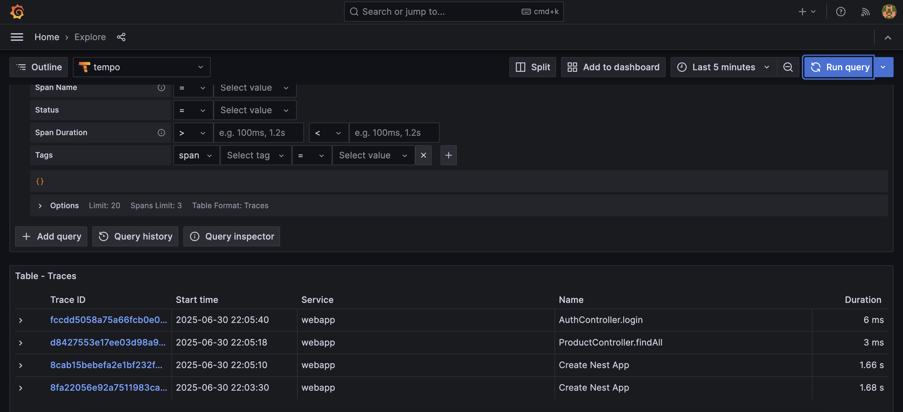
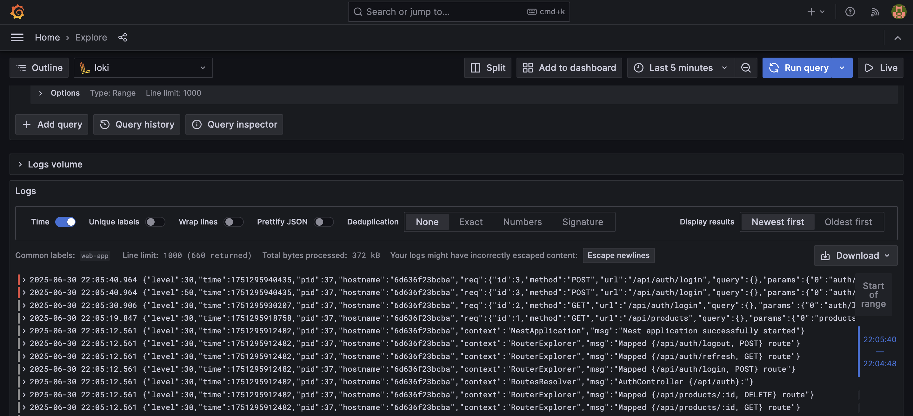
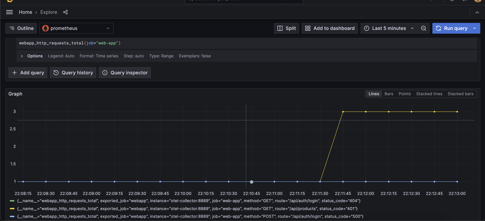

# NestJS Starter Project

A comprehensive NestJS starter project with full observability stack including OpenTelemetry, Prometheus, Grafana, Loki, and Tempo.

## Features

- **NestJS Framework** with TypeScript
- **OpenAPI Swagger** documentation
- **Authentication System** with JWT
- **PostgreSQL Database** with TypeORM
- **Complete Observability Stack**:
  - **OpenTelemetry** for metrics and tracing
  - **Prometheus** for metrics collection
  - **Grafana** for visualization
  - **Loki** for log aggregation
  - **Tempo** for distributed tracing
  - **Promtail** for log shipping

## Prerequisites

- Docker
- GNU Make

## Installation

```bash
$ make buildApplication
```

## Running the app

```bash
$ make runApplication
```

## Observability

1. Login to http://localhost:3000 (default username/pass: admin/admin)
2. Setup Loki, Prometheus, and Tempo data source
3. Sample

- Trace
  

- Logs
  
- Metrics
  
